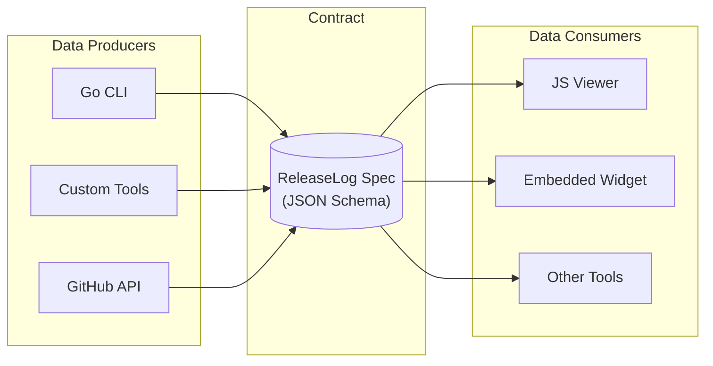
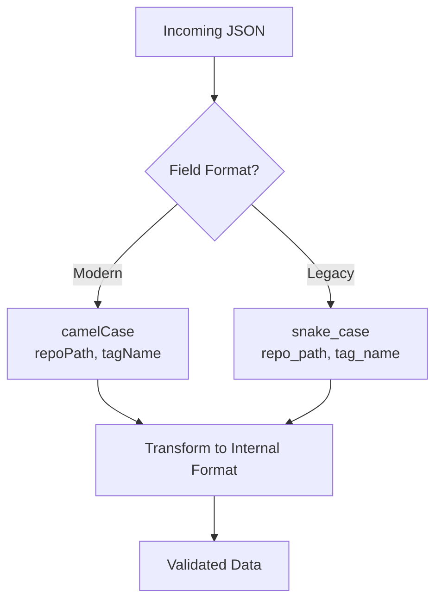
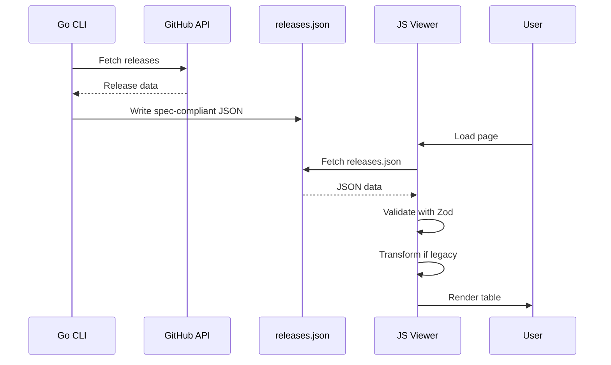

# Architecture

ReleaseLog uses a **specification-first** design where the JSON schema serves as the contract between data producers and consumers.

## Design Overview



## Key Principles

### 1. Specification as Contract

The [ReleaseLog Specification](../reference/specification.md) defines the JSON format that links producers and consumers:

- **Producers** generate JSON that conforms to the spec
- **Consumers** validate and render JSON that conforms to the spec
- **Neither side depends on the other's implementation**

This decoupling means:

- The Go CLI can be replaced with any tool that produces valid JSON
- The JS viewer can be replaced with any tool that consumes valid JSON
- New producers and consumers can be added without coordination

### 2. Schema Validation

The JS library uses [Zod schemas](../guide/typescript-zod.md) to validate incoming data at runtime:

```typescript
import { parseReleaseLog, safeParseReleaseLog } from '@grokify/releaselog';

// Throws on invalid data
const data = parseReleaseLog(jsonResponse);

// Safe parse (returns result object)
const result = safeParseReleaseLog(jsonResponse);
if (result.success) {
  // data is validated and typed
}
```

### 3. Backward Compatibility

The spec supports both modern camelCase and legacy snake_case field names:



| Modern (camelCase) | Legacy (snake_case) |
|--------------------|---------------------|
| `specVersion` | `ir_version` |
| `generatedAt` | `generated_at` |
| `repoPath` | `repo_path` |
| `tagName` | `tag_name` |
| `publishedAt` | `published_at` |
| `urls.githubRelease` | `html_url` |

## Data Flow



## Producer Examples

### Go CLI (Primary Producer)

The Go CLI fetches releases from GitHub and outputs spec-compliant JSON:

```bash
releaselog fetch --org myorg --output releases.json
```

Output:

```json
{
  "specVersion": "0.1.0",
  "generatedAt": "2026-02-01T10:00:00Z",
  "releases": [...]
}
```

### Custom Producer

Any tool can produce valid ReleaseLog JSON:

```python
import json
from datetime import datetime

data = {
    "specVersion": "0.1.0",
    "generatedAt": datetime.utcnow().isoformat() + "Z",
    "releases": [
        {
            "repoPath": "org/repo",
            "repoOwner": "org",
            "repoName": "repo",
            "type": "release",
            "tagName": "v1.0.0",
            "name": "Version 1.0.0",
            "publishedAt": "2026-02-01T10:00:00Z"
        }
    ]
}

with open("releases.json", "w") as f:
    json.dump(data, f, indent=2)
```

## Consumer Examples

### JS Viewer (Primary Consumer)

```javascript
new ReleaseLog.ReleaseLog('#releases', {
  ajaxURL: '/releases.json'
});
```

### Direct API Usage

```typescript
import { parseReleaseLog, filterReleases } from '@grokify/releaselog';

const response = await fetch('/releases.json');
const data = parseReleaseLog(await response.json());

const filtered = filterReleases(data.releases, {
  repoFilter: new Set(['org/repo']),
  typeFilter: 'release'
});
```

## Benefits

| Benefit | Description |
|---------|-------------|
| **Loose Coupling** | Producers and consumers evolve independently |
| **Interoperability** | Any conforming tool works with any other |
| **Validation** | Runtime schema validation catches errors early |
| **Extensibility** | Add new producers/consumers without breaking existing ones |
| **Testability** | Test against the spec, not implementations |
