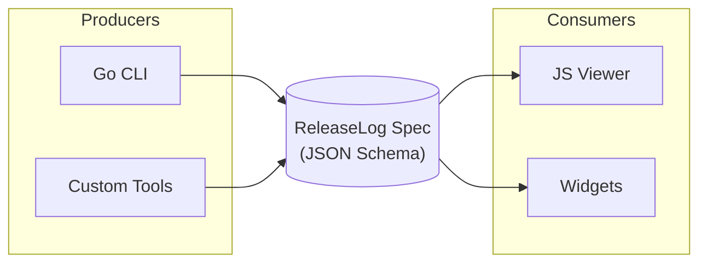

# ReleaseLog

**Aggregate GitHub releases into a unified JSON format with filterable viewers.**

ReleaseLog provides tools to collect release information from multiple GitHub repositories and present them in a consistent, searchable interface.

## Architecture

ReleaseLog uses a **specification-first** design where the JSON schema serves as the contract between data producers (Go CLI, custom tools) and consumers (JS viewer, widgets).



[Learn more about the architecture →](guide/architecture.md)

## Features

- **Specification-First Design** - JSON schema as the contract between producers and consumers
- **JSON Intermediate Representation** - Standardized format for release data
- **HTML Viewer** - Interactive, filterable table view
- **JavaScript Library** - Embeddable widget for any website
- **TypeScript Support** - Full type definitions with Zod schemas
- **Heatmap Visualization** - GitHub-style activity heatmap
- **WCAG 2.2 AA Compliant** - Accessible to all users
- **CDN Ready** - Include via script tag or npm install

## Quick Example

```html
<link rel="stylesheet" href="https://unpkg.com/@grokify/releaselog/dist/releaselog.css">
<script src="https://unpkg.com/@grokify/releaselog/dist/releaselog.umd.js"></script>

<div id="releases"></div>

<script>
  new ReleaseLog.ReleaseLog('#releases', {
    ajaxURL: 'https://example.com/releases.json'
  });
</script>
```

## Use Cases

- **Organization Release Dashboards** - Track releases across all your repos
- **Open Source Project Pages** - Show users the latest versions
- **Internal Tools** - Monitor dependency updates
- **Changelog Aggregation** - Combine changelogs from multiple sources

## Installation

=== "npm"

    ```bash
    npm install @grokify/releaselog
    ```

=== "CDN"

    ```html
    <script src="https://unpkg.com/@grokify/releaselog"></script>
    ```

=== "Download"

    Download from [GitHub Releases](https://github.com/grokify/releaselog/releases)

## Documentation

- [Getting Started](getting-started/installation.md) - Installation and setup
- [Architecture](guide/architecture.md) - Specification-first design
- [JSON Format](guide/json-format.md) - ReleaseLog JSON specification
- [HTML Viewer](guide/html-viewer.md) - Standalone viewer usage
- [JavaScript Library](guide/javascript-library.md) - Embedding in your site
- [TypeScript & Zod](guide/typescript-zod.md) - Type-safe development
- [Heatmap](guide/heatmap.md) - Activity visualization
- [Accessibility](accessibility.md) - WCAG 2.2 AA compliance

## Links

- [GitHub Repository](https://github.com/grokify/releaselog)
- [npm Package](https://www.npmjs.com/package/@grokify/releaselog)
- [Specification v0.1.0](reference/specification.md)
